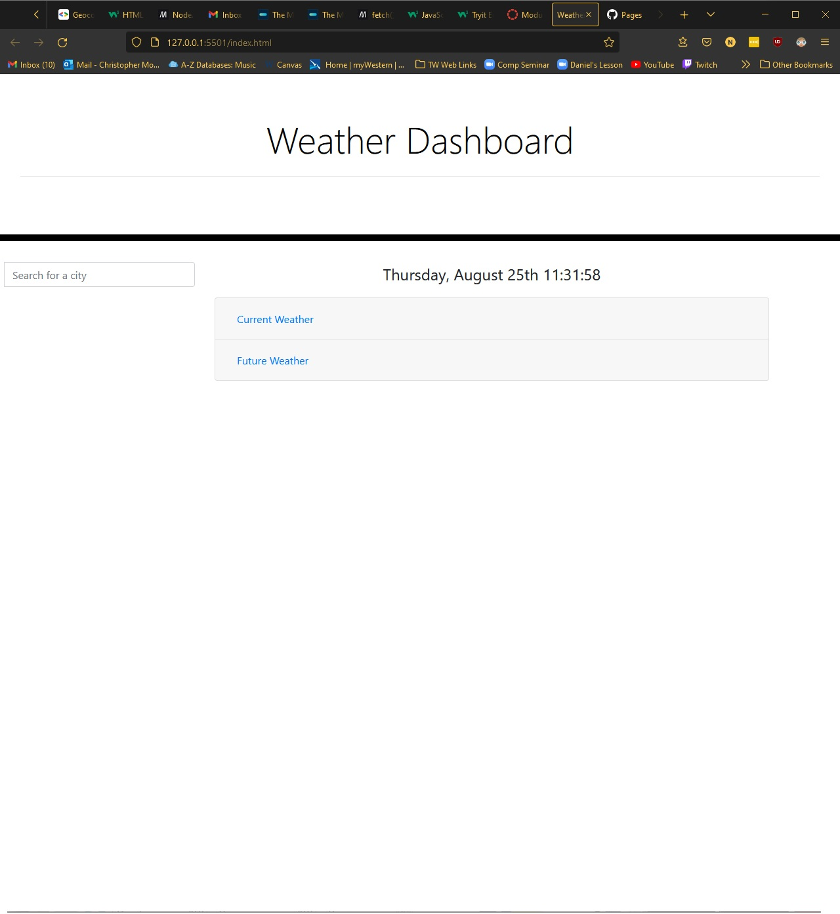
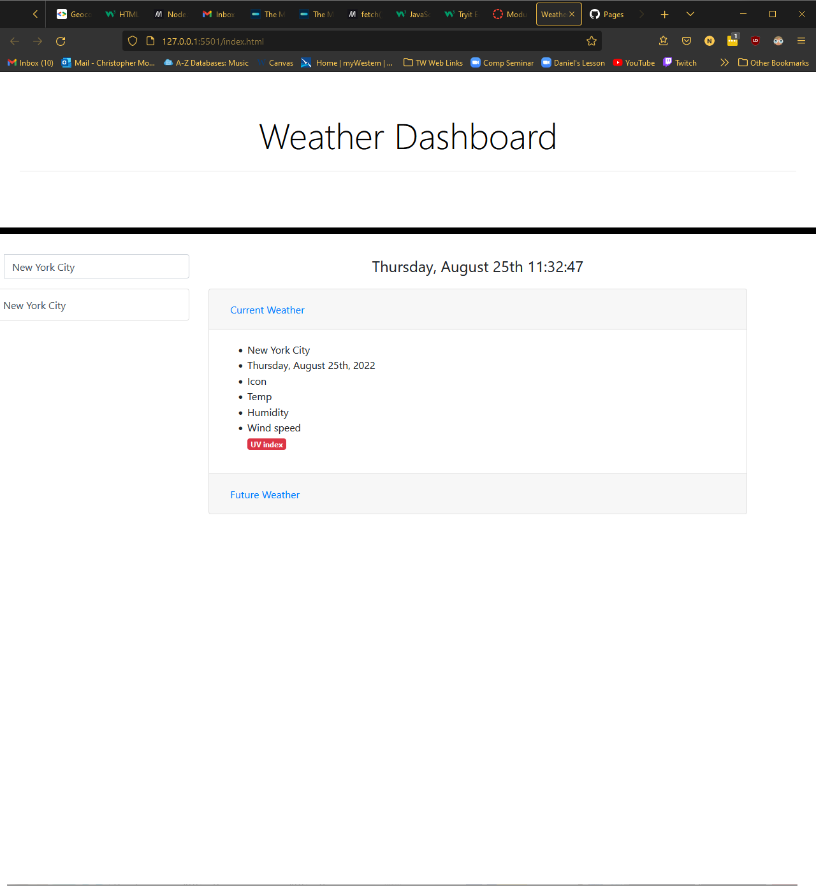

# weather-dashboard

This weather dashboard uses two APIs to convert the user's chosen city into latitude and longitude coordinates, and then uses those coordinates to retrieve weather data about the city. Only one of the two APIs is working as of now, so although a city can be converted to coordinates, weather data cannot be retrieved.

https://nookworth.github.io/weather-dashboard/

